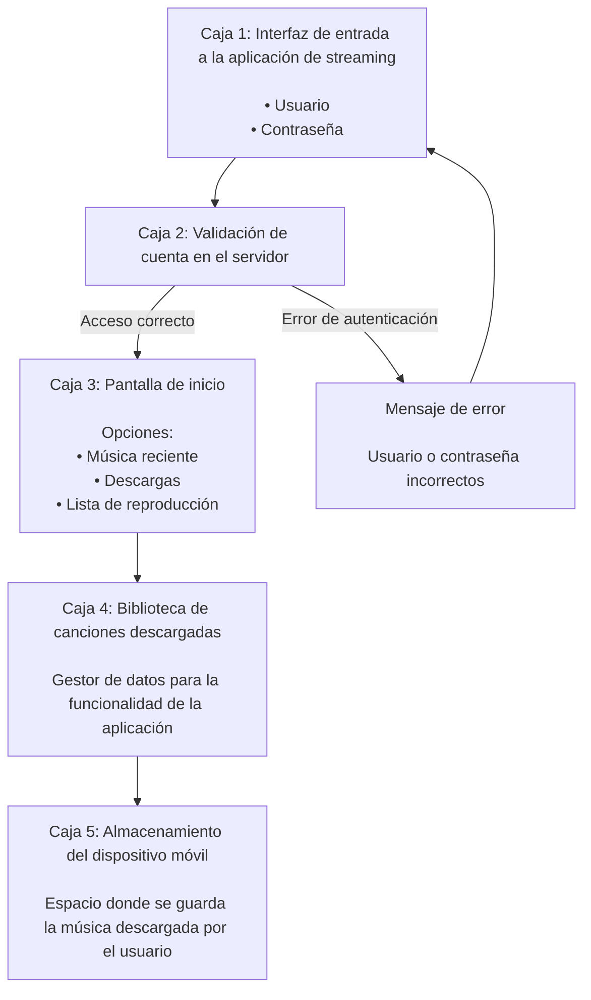

```mermaid
flowchart TD

    A["Caja 1: Interfaz de entrada a la aplicación de streaming<br><br>• Usuario<br>• Contraseña"] --> B["Caja 2: Validación de cuenta en el servidor"]

    B -->|Acceso correcto| C["Caja 3: Pantalla de inicio<br><br>Opciones:<br>• Música reciente<br>• Descargas<br>• Lista de reproducción"]

    C --> D["Caja 4: Biblioteca de canciones descargadas<br><br>Gestor de datos para la funcionalidad de la aplicación"]

    D --> E["Caja 5: Almacenamiento del dispositivo móvil<br><br>Espacio donde se guarda la música descargada por el usuario"]

    B -->|Error de autenticación| F["Mensaje de error<br><br>Usuario o contraseña incorrectos"]

    F --> A
```
